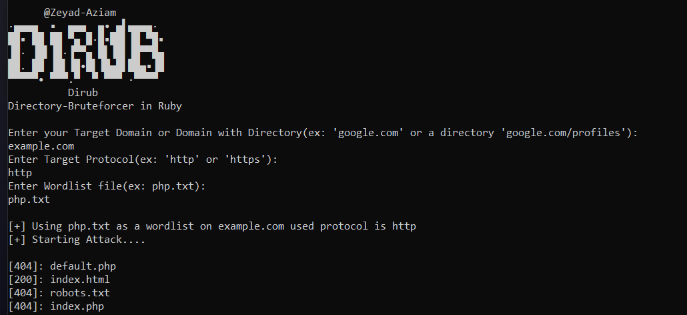

# Dirub
Fast Directory Bruteforcer Written in Ruby

# Install:
```
git clone https://github.com/Zeyad-Azima/Dirub
chmod +x Dirub.rb
ruby Dirub.rb
```
# Screenshot:


# About:
<a href='https://www.facebook.com/elkingzeyad.azeem/'>@Zeyad-Azima</a>
